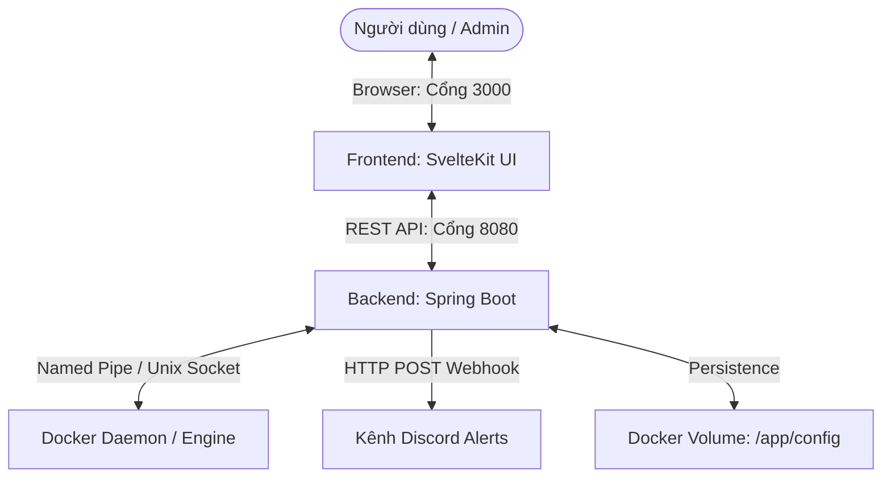

# Server Sentinel 🛡️

**Server Sentinel** là một hệ thống giám sát hiệu năng máy chủ thời gian thực và tự động phục hồi (**Auto-heal**) các Docker Container bị lỗi/sập. Dự án được thiết kế độc lập với giao diện Web hiện đại, trực quan cùng cơ chế cảnh báo tự động qua Discord Webhook.

---

## ✨ Tính năng nổi bật

1. **Giám sát hiệu năng thời gian thực**:
   - Hiển thị phần trăm tải CPU (CPU Load) bằng đồ họa trực quan.
   - Thống kê chi tiết dung lượng RAM (Đã dùng, Còn trống, Tổng RAM) của máy chủ vật lý.
2. **Lịch sử Hiệu năng & Biểu đồ SVG cực nhẹ**:
   - Lưu trữ rolling buffer 30 phút gần nhất (60 điểm dữ liệu, chu kỳ 30 giây).
   - Biểu diễn trực quan xu hướng CPU và RAM bằng biểu đồ SVG thuần (HTML5 `<svg>` Line Chart) sử dụng màu gradient mượt mà, tối ưu hóa dung lượng (0 bytes thư viện ngoài).
3. **Quản trị Docker Container trực quan**:
   - Liệt kê toàn bộ container hiện có trên hệ thống với màu sắc biểu diễn trạng thái sinh động (Running, Exited, v.v.).
   - Thực thi trực tiếp các thao tác điều khiển: **Start**, **Stop**, **Restart** container ngay trên Web UI với hiệu ứng loading.
   - Bộ lọc tìm kiếm nhanh container theo Tên hoặc Image.
   - Sao chép nhanh ID container chỉ với 1 cú click.
4. **Xem trực tiếp Logs Container**:
   - Tích hợp một **Terminal Modal** chuyên nghiệp nền tối chữ xanh lá để xem logs container trực tiếp từ giao diện.
   - Cho phép chọn số lượng dòng logs hiển thị (50, 100, 200, 500 dòng) và nút tải lại tức thì.
5. **Cơ chế Tự phục hồi thông minh (Auto-healing) với Whitelist lâu dài**:
   - Tích hợp một Scheduler định kỳ quét trạng thái Docker Daemon.
   - Phát hiện các container bị sập (`exited`). Nếu container đó nằm trong danh sách Whitelist cho phép cứu, hệ thống sẽ tự động khởi chạy lại (`docker start`) tức thì.
   - Bật/tắt chế độ tự phục hồi cho từng container bằng công tắc (Switch toggle) nhanh trên giao diện.
   - **Lưu trữ Whitelist lâu dài**: whitelist được lưu đồng bộ ra tệp `/app/config/whitelist.txt` trên Docker Volume giúp duy trì cấu hình ngay cả khi khởi động lại hoặc xây dựng lại cụm container.
6. **Bảo mật bằng Google OAuth2 & Danh sách truy cập Whitelist (Mới)**:
   - Dashboard được bảo vệ bởi màn hình đăng nhập Google Sign-In sử dụng Google Identity Services SDK.
   - Phân quyền email truy cập động qua tệp cấu hình `/app/config/allow_accesss.txt` trên Docker Volume (đọc trực tiếp thời gian thực khi xác thực).
7. **Cấu hình Động & Cảnh báo qua Discord**:
   - Tự động phát thông báo khi hệ thống khởi động.
   - **Bảng cấu hình động trên UI**: Cập nhật trực tiếp ngưỡng cảnh báo CPU (%), ngưỡng RAM trống tối thiểu (MB) và URL Discord Webhook trực tiếp từ giao diện Web mà không cần khởi động lại Server.
   - Cấu hình được lưu trữ vĩnh viễn vào tệp `/app/config/settings.json` thông qua Docker Volume.
   - Gửi báo cáo chi tiết về Discord khi phát hiện container sập và kết quả tự động khôi phục (Thành công/Thất bại).
8. **Tích hợp Model Context Protocol - MCP Server (Mới)**:
   - Tích hợp tệp `mcp-server.js` chạy stdio JSON-RPC 2.0. Cho phép các AI Agent (như Cursor, Claude Desktop) kết nối trực tiếp để kiểm tra tài nguyên và điều khiển container.

---

## 🛠️ Công nghệ sử dụng

### Backend (Spring Boot API)
- **Runtime**: Java 17 / Spring Boot 4.1.0
- **Docker Integration**: `docker-java` client (kết nối qua Unix Socket trên Linux hoặc Named Pipe trên Windows).
- **Authentication**: Xác thực Google ID Token qua Google API Gateway.
- **Build Tool**: Gradle (Kotlin DSL)

### Frontend (SvelteKit UI)
- **Framework**: SvelteKit 5 (chia nhỏ dạng mô-đun các file Svelte Components).
- **Style**: Tailwind CSS v4.

---

## 🏗️ Kiến trúc hệ thống



---

## 🚀 Hướng dẫn cài đặt & Khởi chạy

### Môi trường chuẩn bị
- Đã cài đặt **Docker** và **Docker Compose**.
- Tạo sẵn một **Discord Webhook URL** trên kênh Discord của bạn để nhận cảnh báo.

### Khởi chạy bằng Docker Compose (Khuyên dùng)

1. Tải dự án và di chuyển vào thư mục gốc:
   ```bash
   cd server-sentinel
   ```
2. Tạo file `.env` tại thư mục gốc và cấu hình Webhook URL ban đầu của bạn (Sau này có thể đổi động trên giao diện):
   ```env
   DISCORD_WEBHOOK_URL=https://discord.com/api/webhooks/your-webhook-id/your-webhook-token
   ALLOWED_AUTO_HEAL_CONTAINERS=
   ```
3. Khởi chạy toàn bộ hệ thống bằng Docker Compose:
   ```bash
   docker compose up -d
   ```
4. Truy cập các cổng dịch vụ trên trình duyệt:
   - **Giao diện Web UI (Dashboard)**: [http://localhost:3000](http://localhost:3000)
   - **API Backend**: [http://localhost:8080](http://localhost:8080)

---

## 🔑 Hướng dẫn Cấu hình Google Login

Để bảo vệ giao diện bằng nút đăng nhập tài khoản Google:

1. **Tạo Google Cloud Project:**
   - Truy cập **[Google Cloud Console](https://console.cloud.google.com/)**, tạo một dự án mới tên là `Server Sentinel`.
2. **Cấu hình OAuth Consent Screen:**
   - Chọn mục **APIs & Services** > **OAuth consent screen**.
   - Chọn User Type là **External** (cho phép mọi Gmail) hoặc **Internal** (chỉ cho phép Gmail doanh nghiệp của bạn). Điền các thông tin liên hệ bắt buộc.
3. **Tạo OAuth Client ID:**
   - Chọn **Credentials** > **+ Create Credentials** > **OAuth client ID**.
   - Chọn Application type là **Web application**.
   - Tại mục **Authorized JavaScript origins**, nhấn **+ Add URI** và điền: `http://localhost:3000` (và domain chạy thật của bạn nếu có).
   - Nhấn **Create** và sao chép chuỗi **Client ID** nhận được.
4. **Cập nhật Client ID vào Code:**
   - Mở tệp tin [LoginPanel.svelte](file:///d:/Server-sentinel/server-sentinel/frontend/src/lib/components/LoginPanel.svelte).
   - Thay thế Client ID mẫu ở hàm `initGoogleSignIn()` bằng Client ID của bạn.
5. **Cấu hình Email Whitelist:**
   - Mở tệp tin [allow_accesss.txt](file:///d:/Server-sentinel/server-sentinel/config/allow_accesss.txt) (tự sinh ra tại thư mục `./config` ở máy host sau lần chạy đầu tiên).
   - Thêm email Google của bạn vào cuối tệp (mỗi dòng một email) để cấp quyền truy cập.

---

## 🤖 Cấu hình & Sử dụng MCP Server

Sentinel tích hợp sẵn máy chủ **Model Context Protocol (MCP)** qua luồng Stdin/Stdout để tích hợp vào các AI Agent của bạn.

### Kết nối với Claude Desktop
Thêm cấu hình sau vào tệp cấu hình Claude Desktop (`%APPDATA%\Claude\claude_desktop_config.json` trên Windows hoặc `~/Library/Application Support/Claude/claude_desktop_config.json` trên macOS):

```json
{
  "mcpServers": {
    "server-sentinel": {
      "command": "node",
      "args": ["D:/Server-sentinel/server-sentinel/mcp-server.js"]
    }
  }
}
```
*(Lưu ý thay thế đường dẫn chính xác tới tệp `mcp-server.js` trên máy của bạn).*

### Kết nối với Cursor
1. Mở cài đặt Cursor (**Settings** > **Features** > **MCP**).
2. Nhấn **+ Add New MCP Server**.
3. Điền thông tin cấu hình:
   - **Name**: `server-sentinel`
   - **Type**: `stdio`
   - **Command**: `node D:/Server-sentinel/server-sentinel/mcp-server.js`

### Các lệnh hỗ trợ:
- `get_system_stats`: Lấy thông số tải CPU, RAM, Ổ cứng, Mạng (Rx/Tx) và GPU hiện tại.
- `get_system_history`: Lấy lịch sử tải máy chủ 30 phút qua.
- `list_containers`: Xem danh sách tất cả các Docker container trên máy.
- `manage_container`: Khởi chạy, dừng hoặc khởi động lại container.
- `get_container_logs`: Đọc logs của container.
- `toggle_auto_heal`: Bật/Tắt tự động phục hồi cho container.
- `update_settings`: Cập nhật cấu hình cảnh báo.

---

## ⚙️ Cấu hình Lưu trữ & Biến môi trường

### Phân vùng Docker Volumes
Để lưu trữ cấu hình Whitelist, phân quyền và Settings động lâu dài, Docker Compose ánh xạ thư mục cấu hình sau:
- Host Path: `./config`
- Container Path: `/app/config`
- Files: `whitelist.txt`, `settings.json`, `allow_accesss.txt`

### Biến môi trường

| Biến môi trường | Ý nghĩa | Mặc định |
| :--- | :--- | :--- |
| `DISCORD_WEBHOOK_URL` | Đường dẫn Discord Webhook để gửi cảnh báo ban đầu | *(Trống)* |
| `ALLOWED_AUTO_HEAL_CONTAINERS` | Danh sách tên container được phép tự phục hồi lúc khởi động (cách nhau bởi dấu phẩy `,`) | *(Trống)* |
| `ORIGIN` | Biến môi trường của SvelteKit Node adapter xác thực tên miền chạy giao diện | `http://localhost:3000` |

---
