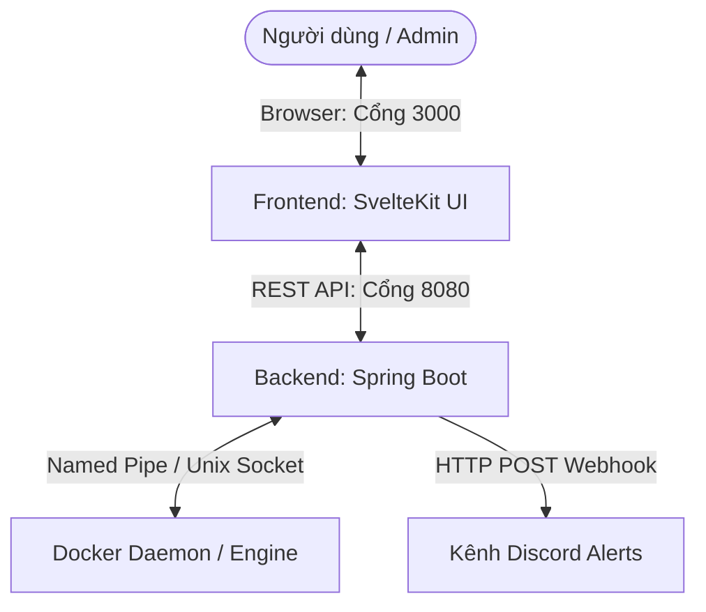

# Server Sentinel 🛡️

**Server Sentinel** là một hệ thống giám sát hiệu năng máy chủ thời gian thực và tự động phục hồi (**Auto-heal**) các Docker Container bị lỗi/sập. Dự án được thiết kế độc lập với giao diện Web hiện đại, trực quan cùng cơ chế cảnh báo tự động qua Discord Webhook.

---

## ✨ Tính năng nổi bật

1. **Giám sát hiệu năng thời gian thực**:
   - Hiển thị phần trăm tải CPU (CPU Load) bằng đồ họa trực quan.
   - Thống kê chi tiết dung lượng RAM (Đã dùng, Còn trống, Tổng RAM) của máy chủ vật lý.
2. **Quản trị Docker Container trực quan**:
   - Liệt kê toàn bộ container hiện có trên hệ thống với màu sắc biểu diễn trạng thái sinh động (Running, Exited, v.v.).
   - Thực thi trực tiếp các thao tác điều khiển: **Start**, **Stop**, **Restart** container ngay trên Web UI với hiệu ứng loading.
   - Bộ lọc tìm kiếm nhanh container theo Tên hoặc Image.
   - Sao chép nhanh ID container chỉ với 1 cú click.
3. **Cơ chế Tự phục hồi thông minh (Auto-healing)**:
   - Tích hợp một Scheduler định kỳ quét trạng thái Docker Daemon.
   - Phát hiện các container bị sập (`exited`). Nếu container đó nằm trong danh sách Whitelist cho phép cứu, hệ thống sẽ tự động khởi chạy lại (`docker start`) tức thì.
   - Bật/tắt chế độ tự phục hồi cho từng container bằng công tắc (Switch toggle) nhanh trên giao diện.
4. **Cảnh báo tức thời qua Discord**:
   - Tự động phát thông báo khi hệ thống khởi động.
   - Cảnh báo khi tài nguyên máy chủ vượt ngưỡng nguy hiểm (Ví dụ: CPU > 90%, RAM trống < 500MB).
   - Gửi báo cáo chi tiết về Discord khi phát hiện container sập và kết quả tự động khôi phục (Thành công/Thất bại).

---

## 🛠️ Công nghệ sử dụng

### Backend (Spring Boot API)
- **Runtime**: Java 17 / Spring Boot 4.1.0
- **Docker Integration**: `docker-java` client (kết nối qua Unix Socket trên Linux hoặc Named Pipe trên Windows).
- **Scheduler**: Spring Task Scheduling thực thi nhiệm vụ tuần tra nền.
- **Build Tool**: Gradle (Kotlin DSL)

### Frontend (SvelteKit UI)
- **Framework**: SvelteKit 5 (chạy chế độ Runes hiện đại nhất).
- **Style**: Tailwind CSS v4 (sử dụng plugin `@tailwindcss/vite` biên dịch siêu tốc).
- **Thiết kế**: Premium Dark Mode, phong cách Glassmorphism sang trọng, responsive tương thích hoàn toàn thiết bị di động.

---

## 🏗️ Kiến trúc hệ thống



---

## 🚀 Hướng dẫn cài đặt & Khởi chạy

### Môi trường chuẩn bị
- Đã cài đặt **Docker** và **Docker Compose**.
- Tạo sẵn một **Discord Webhook URL** trên kênh Discord của bạn để nhận cảnh báo.

### Khởi chạy bằng Docker Compose (Khuyên dùng)

1. Tải dự án và di chuyển vào thư mục gốc:
   ```bash
   cd server-sentinel
   ```
2. Tạo file `.env` tại thư mục gốc và cấu hình Webhook URL của bạn:
   ```env
   DISCORD_WEBHOOK_URL=https://discord.com/api/webhooks/your-webhook-id/your-webhook-token
   ALLOWED_AUTO_HEAL_CONTAINERS=
   ```
3. Khởi chạy toàn bộ hệ thống bằng Docker Compose:
   ```bash
   docker compose up -d
   ```
4. Truy cập các cổng dịch vụ trên trình duyệt:
   - **Giao diện Web UI (Dashboard)**: [http://localhost:3000](http://localhost:3000)
   - **API Backend**: [http://localhost:8080](http://localhost:8080)

---

## ⚙️ Biến môi trường cấu hình (Environment Variables)

| Biến môi trường | Ý nghĩa | Mặc định |
| :--- | :--- | :--- |
| `DISCORD_WEBHOOK_URL` | Đường dẫn Discord Webhook để gửi cảnh báo | *(Trống)* |
| `ALLOWED_AUTO_HEAL_CONTAINERS` | Danh sách tên container được phép tự phục hồi lúc khởi động (cách nhau bởi dấu phẩy `,`) | *(Trống)* |
| `ORIGIN` | Biến môi trường của SvelteKit Node adapter xác thực tên miền chạy giao diện | `http://localhost:3000` |

---

## 📝 Giấy phép
Dự án được phát triển nhằm mục đích quản trị và giám sát hạ tầng Docker cá nhân một cách gọn nhẹ và hiệu quả.
