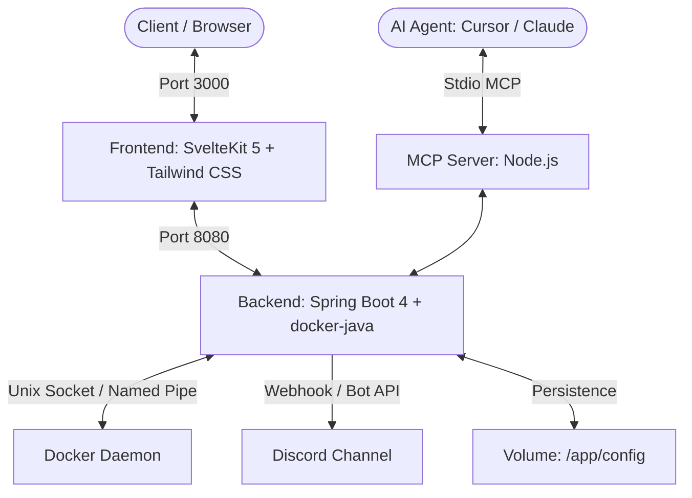

# Server Sentinel

Server Sentinel là nền tảng quản trị và giám sát máy chủ thời gian thực, tích hợp cơ chế tự phục hồi (Auto-Heal) cho Docker Container và hệ thống cảnh báo qua Discord. Hệ thống cung cấp giao diện Web trực quan (SvelteKit), backend Spring Boot hiệu năng cao và hỗ trợ giao thức Model Context Protocol (MCP) dành cho AI Agent.

---

## Kiến trúc hệ thống


```mermaid
graph TD
    User([Client / Browser]) <-->|Port 3000| Frontend[Frontend: SvelteKit 5 + Tailwind CSS]
    Frontend <-->|Port 8080| Backend[Backend: Spring Boot 4 + docker-java]
    Backend <-->|Unix Socket / Named Pipe| Docker[Docker Daemon]
    Backend -->|Webhook / Bot API| Discord[Discord Channel]
    Backend <-->|Persistence| Storage[Volume: /app/config]
    AIAgent([AI Agent: Cursor / Claude]) <-->|Stdio MCP| MCPServer[MCP Server: Node.js]
    MCPServer <--> Backend
```

---

## Tính năng chính

- **Home Hub & Search Engine**: Trang chủ tích hợp tìm kiếm thông minh đa nguồn (Bing, Google, Containers, Files), phím tắt dịch vụ nhanh (Shortcuts kèm Favicon) và các widget tiện ích kéo thả (Module Hub).
- **Giám sát thời gian thực**: Đo lường và hiển thị trực quan mức tải CPU, RAM, ổ đĩa, băng thông mạng và GPU (nếu có).
- **Lịch sử hiệu năng**: Lưu trữ bộ đệm 30 phút gần nhất, trực quan hóa xu hướng tải bằng biểu đồ vector SVG thuần nhẹ và mượt mà.
- **Quản lý Docker Container**:
  - Theo dõi trạng thái, tài nguyên và logs thời gian thực.
  - Điều khiển container trực tiếp: Khởi chạy (Start), Dừng (Stop), Khởi động lại (Restart).
- **Cơ chế Auto-Heal (Tự phục hồi)**:
  - Tự động phát hiện container gặp sự cố hoặc dừng đột ngột.
  - Tự kích hoạt lại các container nằm trong danh sách kiểm duyệt (Whitelist).
  - Đồng bộ danh sách Whitelist bền vững vào tệp cấu hình trên phân vùng lưu trữ.
- **Trình quản lý tệp tin (File Manager)**: Duyệt cây thư mục máy chủ, xem trước mã nguồn/media và hỗ trợ hàng đợi tải lên an toàn.
- **Bảo mật truy cập**:
  - Đăng nhập xác thực qua Google OAuth2 (Google Identity Services SDK).
  - Quản lý danh sách email được cấp phép truy cập (Access Whitelist).
- **Cảnh báo và cấu hình động**:
  - Tùy chỉnh ngưỡng cảnh báo CPU/RAM trực tiếp từ giao diện không cần khởi động lại dịch vụ.
  - Gửi thông báo tức thì tới Discord khi vượt ngưỡng tải hoặc khi container được khôi phục.
- **Tích hợp Model Context Protocol (MCP)**: Cho phép các trợ lý AI (Cursor, Claude Desktop) đọc thông số máy chủ và quản lý container qua giao thức chuẩn hóa.

---

## Công nghệ sử dụng

| Thành phần | Công nghệ | Mô tả |
| :--- | :--- | :--- |
| **Backend** | Java 17, Spring Boot 4.1.0 | RESTful API, Docker Client, Scheduler |
| **Frontend** | SvelteKit 5, Tailwind CSS v4, TypeScript | Giao diện Single Page Application, WebSockets / Polling |
| **AI Integration** | Node.js, MCP SDK | Máy chủ MCP JSON-RPC 2.0 giao tiếp stdio |
| **Triển khai** | Docker, Docker Compose | Đóng gói môi trường container hóa toàn diện |

---

## Hướng dẫn cài đặt và triển khai

### Yêu cầu hệ thống
- Docker Engine và Docker Compose (v2.x trở lên).
- Cổng khả dụng: `3000` (Frontend), `8080` (Backend).

### Triển khai nhanh bằng Docker Compose

1. Di chuyển vào thư mục dự án:
   ```bash
   cd server-sentinel
   ```

2. Tạo tệp `.env` tại thư mục gốc:
   ```env
   DISCORD_WEBHOOK_URL=https://discord.com/api/webhooks/your-id/your-token
   ALLOWED_AUTO_HEAL_CONTAINERS=
   ORIGIN=http://localhost:3000
   ```

3. Khởi chạy hệ thống:
   ```bash
   docker compose up -d --build
   ```

4. Truy cập giao diện:
   - **Dashboard UI**: `http://localhost:3000`
   - **API Endpoint**: `http://localhost:8080`

---

## Cấu hình chi tiết

### 1. Xác thực Google OAuth2

1. Truy cập **Google Cloud Console**, tạo dự án mới và tạo OAuth Client ID (loại Web Application).
2. Thêm domain truy cập vào **Authorized JavaScript origins** (ví dụ: `http://localhost:3000` hoặc IP máy chủ của bạn).
3. Cập nhật Client ID vào giao diện tại `frontend/src/lib/components/LoginPanel.svelte`.
4. Cấp quyền truy cập bằng cách thêm địa chỉ Gmail vào tệp `config/allow_accesss.txt` (mỗi dòng một email).

### 2. Tích hợp AI Agent (MCP Server)

Thêm cấu hình vào trình biên tập hỗ trợ MCP (như Cursor hoặc Claude Desktop):

```json
{
  "mcpServers": {
    "server-sentinel": {
      "command": "node",
      "args": ["/duong/dan/tuyet/doi/server-sentinel/mcp-server.js"]
    }
  }
}
```

Các công cụ MCP cung cấp:
- `get_system_stats`: Truy vấn thông số tài nguyên hệ thống hiện tại.
- `get_system_history`: Lấy lịch sử tải máy chủ trong 30 phút.
- `list_containers`: Liệt kê danh sách và trạng thái toàn bộ Docker container.
- `manage_container`: Khởi chạy, dừng hoặc khởi động lại container chỉ định.
- `get_container_logs`: Trích xuất nhật ký logs của container.
- `toggle_auto_heal`: Cấu hình bật/tắt tự động hồi phục cho container.
- `update_settings`: Cập nhật cấu hình ngưỡng cảnh báo và Discord.

---

## Cấu trúc lưu trữ dữ liệu

Dữ liệu cấu hình được duy trì lâu dài thông qua volume liên kết giữa host và container:

| Host Path | Container Path | Chức năng |
| :--- | :--- | :--- |
| `./config/whitelist.txt` | `/app/config/whitelist.txt` | Danh sách container được phép Auto-Heal |
| `./config/settings.json` | `/app/config/settings.json` | Cấu hình ngưỡng cảnh báo CPU/RAM và Discord |
| `./config/allow_accesss.txt` | `/app/config/allow_accesss.txt` | Danh sách email được phép đăng nhập qua Google |

---

## Giấy phép

Dự án được phân phối dưới giấy phép MIT.
